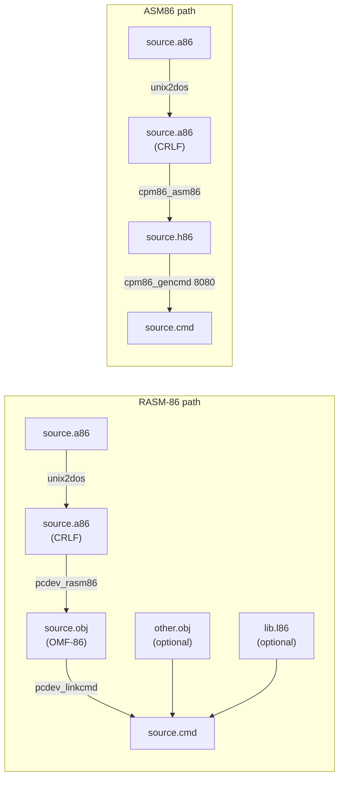

# CP/M-86 Assembly Guide

## 1. Toolchain Overview

Two toolchain paths produce a runnable `.cmd` binary.


```mermaid
flowchart LR
    subgraph RASM-86 path
        A86["source.a86"] -->|unix2dos| DOS["source.a86\n(CRLF)"]
        DOS -->|pcdev_rasm86| OBJ["source.obj\n(OMF-86)"]
        OBJ -->|pcdev_linkcmd| CMD1["source.cmd"]
        OBJ2["other.obj\n(optional)"] --> CMD1
        LIB["lib.l86\n(optional)"] --> CMD1
    end
    subgraph ASM86 path
        B86["source.a86"] -->|unix2dos| BDOS2["source.a86\n(CRLF)"]
        BDOS2 -->|cpm86_asm86| H86["source.h86"]
        H86 -->|cpm86_gencmd 8080| CMD2["source.cmd"]
    end
```

**RASM-86** produces OMF-86 `.obj` files that LINK-86 combines into a `.cmd`.
Use it for all multi-segment, multi-module, and library work.
**ASM86+GENCMD** is a simpler hex-file path supporting single- and
multi-segment programs; it has no OMF multi-module linking step.
See §5 and §8 for the comparison.

> Both tools require **CRLF line endings** — run `unix2dos` before assembling (§11 gotcha #2).

---

## 2. Program Entry State

CP/M-86 sets registers before jumping to the program entry point.

### `org 100h` (single-segment, via RASM-86 or ASM86)

| Register | Value at entry | Notes |
|----------|---------------|-------|
| CS | code segment | your `cseg` |
| DS | base-page group | CS in the 8080 model; separate DATA group if linked |
| ES | base-page segment | same as DS |
| SS:SP | inherited CCP stack | not initialized by the loader; see §10 |
| DS:80h | command tail length | byte count |
| DS:81h | command tail text | space + args |

> Read the command tail **before** redirecting DS (§7.7, §11 gotcha #9).

### Dual/triple/stack-segment (RASM-86 via LINK-86, or ASM86 via GENCMD no keyword)

| Register | Value at entry | Notes |
|----------|---------------|-------|
| CS | `cseg` base | — |
| DS | `dseg` / dgroup base | set by loader from DATA header |
| ES | `eseg` base (if present) | else = DS |
| SS:SP | inherited CCP stack | a STACK header allocates storage, not register setup |

The CMD headers, not `org` alone, determine the model. With no DATA group
(8080 model), DS = ES = CS and entry IP is `100h`. With a DATA group, DS points
to its base page; even an `org 100h` program can have a separate base-page DATA
group when linked that way. Explicitly setting DS/ES to CS is harmless in the
8080 model and necessary for code-resident data in the latter layout.

---

## 3. Segment Patterns

### 3.1 Single Segment — `org 100h`

Source: [`ex1sing.a86`](ex1sing.a86)

Single `cseg` with `org 100h`. This example's link rule emits a CODE-only
8080-model CMD, so DS = ES = CS at entry. Explicitly setting DS and ES to CS
also supports linking the same source with a separate base-page DATA group.

Key points:
- `jmp main` at top so execution skips data
- All data defined **before** code (avoids forward-reference ERROR 8)
- `key_char rb 1` — saves BDOS return value before the next BDOS call clobbers AX/BX
- `end main` names the entry point

### 3.2 Dual Segment — CODE + DATA

Source: [`ex2dual.a86`](ex2dual.a86)

Separate `cseg` (code) and `dseg` (data). CP/M-86 loader sets DS to the data
segment base at entry — no redirect needed for DS, but ES must be copied from DS
before using string instructions.

Key points:
- `mov cx,ds` / `mov es,cx` at entry — DS is already correct
- `offset line1` resolves into the dseg; DS points there at entry
- `end` with **no label** — LINK-86 uses the first code byte as entry point

### 3.3 Triple Segment — CODE + DATA + EXTRA

Source: [`ex3trip.a86`](ex3trip.a86)

Adds an `eseg` (extra segment). The loader sets ES to the extra segment base.
Demonstrates `rep movsb` copying from DS:SI (dseg) to ES:DI (eseg), then
printing the copy.

Key points:
- `mov ax,seg dst_buf` / `mov es,ax` — reload ES explicitly from the extra segment
- `rep movsb` copies SRC_LEN bytes including the `'$'` terminator
- After copy, `mov ax,es` / `mov ds,ax` redirects DS so fn 9 can print from eseg
- `end` with no label

### 3.4 Explicit Stack Segment

Source: [`ex4stak.a86`](ex4stak.a86)

Adds an `sseg` and groups DATA + STACK into `dgroup`. LINK-86 produces no
"NO STACK SEGMENT" warning.

Key points:
- `dgroup group DATA,STACK` — one segment register covers both
- `rw 32` reserves 64 bytes; `stk_top rw 0` places a label at the top (SP initial value)
- `mov ax,seg stk_top` returns the dgroup base; sets SS, DS, ES, and SP in one block
- `cli` / `sti` protects the adjacent SS/SP writes; the loader does not do this setup
- `end main` (explicit entry label needed because sseg comes first in source)

For stack budgeting, startup, and termination rules, see
[§10: Stack Management](#10-stack-management).

---

## 4. Multi-Module and Libraries

### 4.1 Public / Extrn — Two-File Link

Sources: [`ex5util.a86`](ex5util.a86) · [`ex5main.a86`](ex5main.a86)

Demonstrates splitting code across two object files linked together.

Key points:
- `ex5util.a86` declares `public str_upper` — no `org`, no entry point, `end` with no label
- `ex5main.a86` declares `extrn str_upper:near` before the `cseg`
- Link command joins both objects: `pcdev_linkcmd 'ex5main=ex5main,ex5util [$sz]'`
- `str_upper` walks a null-terminated string in-place; `and al,0DFh` clears bit 5 → uppercase
- After calling `str_upper`, the null at offset 20 is already in place; the `'$'` at offset 21 lets fn 9 print the result directly

### 4.2 Library Creation and Use (LIB-86)

Sources: [`add16.a86`](add16.a86) · [`mul16.a86`](mul16.a86) · [`ex6lib.a86`](ex6lib.a86)

Demonstrates building a `.l86` library and linking against it.

Key points:
- `add16.a86`: `public add_u16` — `add ax,bx; ret`; no entry point
- `mul16.a86`: `public mul_u16` — `mul bx; ret`; DX clobbered (high 16 bits of product)
- Library built with: `pcdev_lib86 'mathlib=add16,mul16'`
- `ex6lib.a86` links against it: `pcdev_linkcmd 'ex6lib=ex6lib,mathlib.l86[search] [$sz]'`
- `[search]` tells LINK-86 to pull only modules that satisfy unresolved extrns
- `word_to_hex` is a local routine in `ex6lib.a86`; all inter-call state lives in named memory vars to survive BDOS clobbering AX/BX


---

## 5. ASM86 / GENCMD Path

ASM86 produces a `.h86` hex file (Digital Research format by default); GENCMD
packages it into a `.cmd`. Two segment models are supported.

### 5.1 Single segment — `8080` model

Source: [`ex7genc.a86`](ex7genc.a86)

Single `cseg org 100h`. Code and data share one segment. GENCMD `8080` keyword
produces a single CODE header; loader sets DS = CS.

Key points:
- Assemble: `cpm86_asm86 ex7genc.a86` → `ex7genc.h86`
- Package: `cpm86_gencmd ex7genc.h86 8080` → single-header `.cmd`
- `jmp main` at top; all data before code (forward-reference rule, same as RASM-86)
- `end` with no label — ASM86 does not accept `end <label>` (§11 gotcha #22)
- DS = ES = CS in the `8080` model; the explicit DS/ES assignments also work
  when linking an `org 100h` source with a separate DATA group

### 5.2 Dual segment — `cseg` + `dseg`

Source: [`ex7gend.a86`](ex7gend.a86)

Separate code and data segments. ASM86 default DR hex embeds the segment type
in each record; GENCMD with **no keyword** reads the layout and produces a
two-header CMD (CODE + DATA).

Key points:
- Assemble: `cpm86_asm86 ex7gend.a86` → `ex7gend.h86`
- Package: `cpm86_gencmd ex7gend.h86` *(no keyword)* → two-header `.cmd`
- **`dseg org 100h` is required** — the loader reserves the first 256 bytes of DS
  for the base page; data placed at DS:0 overlaps it (§11 gotcha #23)
- DS is set by the loader at entry — no redirect needed; set ES = DS explicitly
- `end` with no label (same rule as single-segment ASM86 programs)

Makefile rules (explicit, to avoid conflict with `%.cmd: %.obj` pattern):

```makefile
ex7gend.h86: ex7gend.a86
	unix2dos $<
	$(ASM86) $<

ex7gend.cmd: ex7gend.h86
	$(GENCMD) $<
```

CMD headers produced:
```
INF: HDR(0)TYP(01,CODE)BAS(0000h)MN(0.1k=96) LEN(96)
INF: HDR(1)TYP(02,DATA)BAS(0000h)MN(0.4k=368)LEN(368)
```

### 5.3 GENCMD `Mn` — minimum segment size

GENCMD uses the **highest address** written in the `.h86` file as the segment size,
rounded up to the next paragraph. Storage reserved with `rb`/`rw`/`rs` contributes
no bytes to the hex, but if initialized data follows the reservation, GENCMD still
sees the correct high-water mark.

The problem arises when uninitialized storage is at the **tail** of the segment —
nothing initialized follows it, so GENCMD never sees those addresses and the CMD
header minimum is too small. The loader allocates only the initialized size; runtime
variables at the tail overlap whatever memory the OS placed there.

**`Mn` tells GENCMD: "this segment needs at least N×16 bytes at runtime,
regardless of where the highest initialized byte is."**

```
cpm86_gencmd prog.h86 DATA[M34]          ; DATA must be ≥ 34×16 = 832 bytes
cpm86_gencmd prog.h86 STACK[M75]         ; STACK ≥ 75×16 = 1200 bytes
cpm86_gencmd prog.h86 DATA[M860]         ; DATA ≥ 860×16 = 34 KB (large buffer)
cpm86_gencmd prog.h86 EXTRA[M1000]       ; EXTRA ≥ 4096×16 bytes (sort workspace)
```

Multiple groups on one line:
```
cpm86_gencmd prog.h86 STACK[M75] DATA[M34]
```

**How to compute `Mn`:** add the sizes of all `rb`/`rw`/`rs` reservations in the
segment, add the initialized data size, add `100h` for the base-page `org` offset,
then round up to the next paragraph. Convert to paragraphs: total bytes ÷ 16.

**`8080` + `CODE[Mn]`:** single-segment programs that place uninitialized data
*after* code in `cseg` (using `DATAOFFSET EQU OFFSET$` / `dseg` / `ORG DATAOFFSET`)
also need `Mn` because the uninitialized data portion isn't in the hex file:
```
cpm86_gencmd du.h86   8080 'CODE[MF00]'   ; cseg + uninitialized data tail
cpm86_gencmd filer.h86 8080 'CODE[M3FF,XF00]'  ; M=minimum, X=maximum
```

`Xn` sets the **maximum** paragraphs the segment may expand into if free memory
allows — useful for programs with variable-size working buffers.

### 5.4 Example — tail uninitialized buffer

Source: [`ex7genu.a86`](ex7genu.a86)

Same logic as ex7gend (read line, process, print) but the DATA segment ends with
`rev_buf rb 200h` — a 512-byte scratch buffer — as its last declaration. Nothing
initialized follows it.

```
crlf_msg    db    CR, LF, '$'        ; last initialized → offset 0x168
rev_buf     rb    REV_SIZE            ; 0x200 bytes tail uninitialized → 0x36B
```

Without `Mn`:
```
INF: HDR(1)TYP(02,DATA)BAS(0000h)MN(0.4k=368)LEN(368)   ← wrong
```
368 = highest initialized address (`0x016B`) rounded to paragraph. `rev_buf` invisible.

With `DATA[M37]`:
```
INF: HDR(1)TYP(02,DATA)BAS(0000h)MN(0.9k=880)LEN(368)   ← correct
```
880 = 55 paragraphs × 16 = covers `org 100h` + initialized + `rb 200h` tail.

**Computing `M37`:**
```
rev_buf end   = 0x016B + 0x200 = 0x036B
+1 for size   = 0x036C = 876 bytes
÷ 16          = 54.75 → round up to 55 paragraphs = 0x37
```

Build:
```makefile
ex7genu.cmd: ex7genu.h86
	$(GENCMD) $< 'DATA[M37]'
```

### 5.5 Example — explicit stack segment

Source: [`ex7gens.a86`](ex7gens.a86)

Extends ex7genu with an explicit `sseg`. The stack is entirely `rw` — zero bytes
in the hex file — so both `DATA[Mn]` and `STACK[Mn]` are required.

```asm
            sseg
stk_space   rw      STKSIZE/2       ; 128 bytes, zero bytes in hex
```

CMD headers produced:
```
INF: HDR(0)TYP(01,CODE) BAS(0000h)MN(0.1k=128) LEN(128)
INF: HDR(1)TYP(02,DATA) BAS(0000h)MN(0.9k=880) LEN(400)
INF: HDR(3)TYP(04,STACK)BAS(0000h)MN(0.1k=128) LEN(0)
```

`LEN=0` on the STACK header means no bytes in the hex file, but `MN=128` tells
the loader to reserve 128 bytes. **The loader does not set SS:SP.** The example
reads the STACK descriptor from the DATA base page and switches explicitly:

```asm
            mov     bx, 12h
            mov     dx, [bx]        ; STACK length - 1
            inc     dx
            mov     bx, 15h
            mov     ax, [bx]        ; STACK base paragraph
            cli
            mov     ss, ax
            mov     sp, dx
            sti
```

See [§10.4](#104-pattern-c-data-stack-or-separate-stack-group) for the descriptor layout and the distinction between grouped
stack storage and a separate STACK group.

**Computing `STACK[M8]`:**
```
STKSIZE = 80h = 128 bytes ÷ 16 = 8 paragraphs → STACK[M8]
```

Build:
```makefile
ex7gens.cmd: ex7gens.h86
	$(GENCMD) $< 'DATA[M37] STACK[M8]'
```

> The four ex7 examples together cover every GENCMD case:
> `ex7genc` (8080), `ex7gend` (dual, no Mn), `ex7genu` (DATA[Mn]), `ex7gens` (DATA[Mn] + STACK[Mn]).

---

## 6. Code-Macros

Source: [`ex8macr.a86`](ex8macr.a86)

RASM-86 `CodeMacro` / `EndM` defines inline byte-encoding macros. Three macros are demonstrated.

Key points:
- `BDOS_CALL fn:Db` — emits `B9h <fn word>` (MOV CX,imm16) + `CDh E0h` (INT 0E0h); parameter type `Db` covers fn 0–255
- `PUSHI imm:Db` — emits `68h <word>` (80186-style PUSH imm16 not in 8086 base set); `PUSHI 041h` then `pop ax` gives AX=41h
- `ESC opcode:Db(0,63), src:Eb` — 8087 escape encoding via `SEGFIX` + `DBIT 5(1Bh),3(opcode(3))` + `MODRM opcode,src`
- `Db` vs `Dw` matters: wrong parameter type causes ERROR 7; `Db` fits -256..255, `Dw` fits any 16-bit value (see §11 gotcha #14)
- `CodeMacro` definitions must appear **before** the `cseg` / `org` directive


---

## 7. Helper Library

All helper modules are archived into `helplib.l86`. The demo program
[`exhelp.a86`](exhelp.a86) is self-contained (inline copies of every routine)
and links standalone; the library modules exist for reuse in other programs.

### 7.1 Primitives (`hlp_num`)

Source: [`hlp_num.a86`](hlp_num.a86)

| Routine | IN | OUT | Notes |
|---|---|---|---|
| `nibble_to_hex` | AL = 0..Fh | AL = ASCII | `'0'..'9'` / `'A'..'F'` |
| `byte_to_hex` | AL = byte | AH = hi ASCII, AL = lo ASCII | does not print |
| `word_to_hex` | AX = word | prints 4 hex chars | via fn 2; state in `w2h_val`/`w2h_cnt` |
| `div10` | AX = dividend | AX = quotient, DX = remainder | unsigned 16÷10; saves/restores BX |
| `word_to_dec` | AX = value | prints decimal | no leading zeros; state in `w2d_buf`/`w2d_len`/`w2d_idx` |
| `hex_to_byte` | SI → 2 hex chars | AL = byte; SI += 2 | `"FF"` → 0FFh |
| `str_to_int` | SI → ASCII decimal | AX = value; SI advanced | stops at first non-digit |

Key points:
- All state that must survive a BDOS call lives in named memory variables — never in AX or BX between `int 0E0h` calls
- `word_to_hex` emulates `ROL AX,4` as 4× `shl ax,1` + carry-feed because RASM-86 8086 mode has no immediate-count rotate
- `str_to_int` uses `mul bx` (BX=10) which clobbers DX — acceptable since no BDOS calls are made inside

### 7.2 String (`hlp_str`)

Source: [`hlp_str.a86`](hlp_str.a86)

| Routine | IN | OUT | Notes |
|---|---|---|---|
| `strlen` | SI → zstring | CX = length | SI preserved |
| `strcpy` | SI → src, DI → dst | SI, DI advanced | copies null terminator |
| `strcmp` | SI → s1, DI → s2 | AL = 0 / 1 / FFh | eq / gt / lt |
| `ltrim` | SI → string | SI → first non-space | modifies SI |
| `rtrim` | SI → string | null placed after last non-space | in-place |
| `str_contains` | SI → string, AL = char | AL = 1 / 0 | found / not found |
| `pad_right` | SI → string, CX = width | spaces appended, null-terminated | in-place; caller ensures buffer fits |
| `toupper_buf` | SI → string | in-place a-z → A-Z | `and al,0DFh` |
| `tolower_buf` | SI → string | in-place A-Z → a-z | `or al,20h` |

Key points:
- No BDOS calls — no clobber risk on AX/BX within these routines
- String convention: byte value 0 = null terminator throughout

### 7.3 I/O (`hlp_io`)

Source: [`hlp_io.a86`](hlp_io.a86)

| Routine | IN | OUT | Notes |
|---|---|---|---|
| `print_char` | AL = char | — | fn 2 |
| `print_crlf` | — | — | two fn 2 calls |
| `cls` | — | — | `ESC[2J` via fn 9 |
| `print_zstr` | SI → zstring | — | fn 2 loop; SI saved in `pzs_si` across each BDOS call |
| `read_line` | DI → buf `[maxlen][0][chars...]` | CX = actual length, text null-terminated | fn 10 wrapper |

Key points:
- `print_zstr` saves SI to memory before every `int 0E0h` and restores it after — BDOS clobbers BX which would corrupt an index register
- `read_line` buffer layout: byte 0 = max length (set by caller), byte 1 filled by BDOS with actual length, bytes 2+ = text

### 7.4 Memory (`hlp_mem`)

Source: [`hlp_mem.a86`](hlp_mem.a86)

| Routine | IN | OUT | Notes |
|---|---|---|---|
| `memset` | SI → buf, CX = count, AL = fill | — | SI, CX clobbered |
| `memcpy` | SI → src, DI → dst, CX = count | SI, DI advanced | same segment |
| `memcmp` | SI → b1, DI → b2, CX = count | AL = 0 / 1 / FFh | eq / gt / lt |

Key points:
- No BDOS calls; straightforward byte loops
- `memcmp` returns 0 (equal), 1 (buf1 > buf2), FFh (buf1 < buf2) — same convention as `strcmp`

### 7.5 File I/O — FCB Layout and Routines (`hlp_file`)

Source: [`hlp_file.a86`](hlp_file.a86)

**FCB layout (36 bytes, must be zero-initialized before use):**

| Offset | Size | Field | Notes |
|---|---|---|---|
| +0 | 1 | drive | 0 = default, 1 = A, 2 = B… |
| +1 | 8 | name | uppercase, space-padded, no null |
| +9 | 3 | ext | uppercase, space-padded, no dot |
| +12 | 4 | extent / s1 / s2 / rc | zeroed by BDOS |
| +16 | 16 | allocation map | zeroed |
| +32 | 1 | cr (current record) | set to 0 before open |
| +33 | 3 | r0 / r1 / r2 (random record) | used by random I/O and `file_open_append` |

| Routine | BDOS fn | IN | OUT | Notes |
|---|---|---|---|---|
| `fcb_init` | — | SI → FCB(36B), BX → name(8B), CX → ext(3B) | FCB zeroed, name/ext copied | pure memory; no BDOS |
| `file_open` | 0Fh | SI → FCB | AL = 0 ok / FFh err | open existing |
| `file_create` | 16h | SI → FCB | AL = 0 ok / FFh err | create or truncate |
| `file_open_append` | 0Fh + 23h | SI → FCB | AL = 0 ok / FFh err | open → compute size → set cr = R0 |
| `file_close` | 10h | SI → FCB | AL = 0 ok / FFh err | flush + close |
| `file_read` | 1Ah + 14h | SI → FCB, DI → 128B buf | AL = 0 ok / non-0 EOF/err | sets DMA offset before read |
| `file_write` | 1Ah + 15h | SI → FCB, DI → 128B buf | AL = 0 ok / non-0 err | sets DMA offset before write |
| `file_delete` | 13h | SI → FCB | AL = 0 or FFh | wildcards allowed in name/ext |

Key points:
- Call `fcb_init` before every open/create — clears cr and random record fields
- Caller must issue fn 33h (Set DMA Segment) **once at startup** pointing to the segment containing the DMA buffer (see §11 gotcha #10)
- `file_open_append`: open (fn 0Fh) → compute file size (fn 23h) → copy FCB+33 (R0) into FCB+32 (cr) — positions sequential write at EOF
- `file_read` / `file_write` set the DMA **offset** (fn 1Ah) each call; the segment is set once by the caller

### 7.6 Calling Convention — BP Stack Frame

Worked example from [`exhelp.a86`](exhelp.a86) — `bp_demo`:

```
Caller:                    Stack after call + push bp:
  mov ax, 42              SP+0 → saved BP
  push ax                 SP+2 → return address   ← [bp+0] / [bp+2]
  call bp_demo            SP+4 → arg (42)         ← [bp+4]
  add sp, 2
```

```asm
bp_demo:
        push    bp
        mov     bp, sp
        mov     ax, 4[bp]       ; fetch argument (indexed: n[reg] syntax)
        call    word_to_dec
        pop     bp
        ret
```

Key points:
- Args pushed right-to-left before `call`; callee does `push bp` / `mov bp,sp`
- First arg is at `4[bp]` (2 bytes ret addr + 2 bytes saved BP)
- Callee cleans its frame with `pop bp; ret`; caller cleans args with `add sp,N`
- Indexed memory syntax in RASM-86: `4[bp]` not `[bp+4]` (see §11 gotcha #5)

### 7.7 Command-Line Parsing (`hlp_cmd`)

Source: [`hlp_cmd.a86`](hlp_cmd.a86)

**Base-page layout (DS:80h at `org 100h` entry):**

| Address | Content |
|---|---|
| DS:80h | Length byte — total chars in tail including leading space |
| DS:81h | First char of tail (usually a space) |
| DS:82h… | Remainder of tail |

| Symbol | Type | Notes |
|---|---|---|
| `parse_cmdline` | routine | call **before** `mov ds,cs` |
| `argv1_buf` | 9-byte buffer | first token, null-terminated (max 8 chars) |
| `argv2_buf` | 9-byte buffer | second token, null-terminated (max 8 chars) |
| `argc_val` | 1-byte var | 0, 1, or 2 |

Key points:
- Must be called **before** redirecting DS to CS — it reads DS:80h/81h (base-page segment)
- Writes results via ES (= CS set by caller before the call) so buffers land in the program's own segment
- Tokens are space-delimited; each capped at 8 chars; extras ignored
- After DS redirect, read `argc_val`, `argv1_buf`, `argv2_buf` normally

### 7.8 Demo Program

Source: [`exhelp.a86`](exhelp.a86)

Self-contained single-segment demo that exercises every helper routine inline.
Links standalone — no external library needed.

Key points:
- `parse_cmdline` called first (DS still = base page); `mov cx,cs` / `mov es,cx` done before that call so `stosb` writes to the correct segment
- `mov cx,FN_SET_SEG` / `mov dx,cs` / `int BDOS` — sets DMA segment to CS once at startup before any file I/O
- File I/O sequence: `fcb_init` → `file_create` → fill DMA buffer → `file_write` → `file_close` → `fcb_init` again → `file_open` → zero DMA buffer → `file_read` → `file_close` → `file_delete`
- BP-frame demo: `mov ax,42` / `push ax` / `call bp_demo` / `add sp,2`


---

## 8. ASM86 vs RASM-86 Syntax Comparison

| Feature | RASM-86 | ASM86 | Notes |
|---|---|---|---|
| Output format | `.obj` (OMF-86) | `.h86` (Intel hex) | RASM-86 → LINK-86; ASM86 → GENCMD |
| Next tool | `pcdev_linkcmd` | `cpm86_gencmd` | — |
| Segment directives | `cseg` / `dseg` / `eseg` / `sseg` | `cseg` / `dseg` / `eseg` / `sseg` | no `segment...ends` Intel syntax in either |
| Multi-segment | yes | yes | GENCMD without `8080` preserves the groups |
| `CodeMacro` / `EndM` | yes | no | RASM-86 only |
| `RD` directive | yes | no | RASM-86 repeat-data |
| `INCLUDE` directive | no | yes | ASM86 only |
| Local symbols param | `$ sz` | `$ S+` | different parameter letter |
| Hex constant format | `0FFh` (trailing `h`) | `0FFH` or `#FF` | case-insensitive in ASM86 |
| Line endings | CRLF required | CRLF required | `unix2dos` before assembling |
| Filename limit | ≤ 8 chars (silently fails on longer) | ≤ 8 chars | see §11 gotcha #1 |
| `JMPS` / `JMPF` | `JMPS` (short), `JMPF` (far) | `JMP SHORT`, `JMP FAR` | — |
| `CALLF` / `RETF` | `CALLF`, `RETF` | `CALL FAR`, `RET FAR` | — |


---

## 9. BDOS Quick Reference

`INT 0E0h` — CL = function number — returns AL = BL — **clobbers AX and BX**.

| fn (hex) | Name | CL | DX in | Returns |
|---|---|---|---|---|
| 00h | Exit (warm boot) | 00h | — | — |
| 01h | Console input | 01h | — | AL = char |
| 02h | Console output | 02h | DL = char | — |
| 09h | Print string | 09h | DX → `'$'`-terminated string | — |
| 0Ah | Read console buffer | 0Ah | DX → `[maxlen][0][chars...]` | buf filled; `[1]` = actual len |
| 0Fh | Open file | 0Fh | DX → FCB | AL = 0 ok / FFh err |
| 10h | Close file | 10h | DX → FCB | AL = 0 ok / FFh err |
| 11h | Search first | 11h | DX → FCB (wildcards ok) | AL = 0 found / FFh not found |
| 13h | Delete file | 13h | DX → FCB (wildcards ok) | AL = 0 ok / FFh err |
| 14h | Read sequential | 14h | DX → FCB | AL = 0 ok / non-0 EOF/err |
| 15h | Write sequential | 15h | DX → FCB | AL = 0 ok / non-0 err |
| 16h | Make (create) file | 16h | DX → FCB | AL = 0 ok / FFh err |
| 1Ah | Set DMA offset | 1Ah | DX = offset of DMA buffer | — |
| 1Bh | Get allocation vector | 1Bh | — | BX → alloc vector |
| 21h | Random read | 21h | DX → FCB (r0/r1/r2 set) | AL = 0 ok / non-0 err |
| 22h | Random write | 22h | DX → FCB (r0/r1/r2 set) | AL = 0 ok / non-0 err |
| 23h | Compute file size | 23h | DX → FCB | FCB+33 = record count |
| 24h | Set random record | 24h | DX → FCB | FCB r0/r1/r2 set from cr |
| 33h | Set DMA segment | 33h | DX = segment value | — |

> **Note:** fn 33h (Set DMA Segment) must be called once at startup for `org 100h` programs before any file I/O — the default DMA segment after relocation is not the program's segment (§11 gotcha #10).


---

## 10. Stack Management

### 10.1 Entry state and stack budget

| Register | CP/M-86 entry value |
|---|---|
| CS:IP | CODE group: `0`, or `100h` in the 8080 model |
| DS | DATA group/base page; CODE group in the 8080 model |
| ES | DS, or EXTRA group if present (not in the 8080 model) |
| SS:SP | **Inherited from the CCP**, not set by the loader |

The reference CP/M-86 CCP reserves 96 bytes (`rs 96` before its `STACK`
label). That is not 96 bytes exclusively for the application: the CCP's own
frames and its four-byte `CALLF` return address share it. Below the stack are
CCP variables and its sector buffer; overflowing it corrupts the CCP.
Other CCP implementations can reserve different amounts.

A STACK group (CMD type 4) only makes the loader allocate memory and record
its base and length in the base page. The application must initialize SS:SP.
STACK descriptor initialization requires a DATA group (type 2); a CODE-only
8080-model program cannot rely on that descriptor.

Count **simultaneously live** stack items, not the number of instructions:

| Operation | Stack bytes |
|---|---:|
| `push`, `pushf`, near `call` | 2 each |
| Far `call` | 4 |
| Interrupt frame (FLAGS, CS, IP) | 6 |
| Arguments and saved registers | add their actual sizes |

Loops with balanced pushes/pops do not accumulate stack usage. Include the
deepest call chain and allow additional headroom for hardware interrupt
handlers and any service code using the caller's stack. Source-level counts
alone are not a complete bound on system-service stack usage.

### 10.2 Pattern A: keep the CCP stack

Source: [`ex10ccp.a86`](ex10ccp.a86)

Appropriate for tiny, shallow programs. The example prints one message and
exits through BDOS function 0. It has no calls or explicit pushes, so each
`INT 0E0h` adds only a six-byte interrupt frame:

```asm
            mov     cx, cs
            mov     ds, cx
            mov     es, cx
            mov     cx, 9
            mov     dx, offset msg
            int     0E0h
            xor     cx, cx
            int     0E0h
```

The message is defined before the code, behind `jmp main`, following the
other single-segment examples. Do not add a private stack merely because a
program calls a helper; first estimate the maximum depth.

Build and run:
```
make ex10ccp.cmd
emu2 ./ex10ccp.cmd
```

### 10.3 Pattern B: stack inside the single group

Source: [`ex10sing.a86`](ex10sing.a86)

For an 8080-model program, reserve stack storage inside its CODE group and
set SS = CS. This example reserves 256 initialized bytes **above the base
page**, with a top label immediately after them:

```asm
stk_space   db      0,0,0,0,0,0,0,0,0,0,0,0,0,0,0,0
            ; Repeat this 16-byte declaration 16 times (see the source).
stk_top     rw      0
```

Startup runs before any helper calls:

```asm
            mov     ax, cs
            mov     ds, ax
            mov     es, ax
            cli
            mov     ss, ax
            mov     sp, offset stk_top
            sti
```

RASM-86 does not accept Intel/MASM `dup` syntax here, so the source uses
16 explicit 16-byte `db` declarations.
The stack grows down into `stk_space`. Initialized bytes are in the image,
so they contribute to the CMD group length and its minimum allocation.
The Makefile links this example with a single CODE group.

Other ways to obtain stack room:

| Method | Allocation requirement |
|---|---|
| Initialized block in the image | Included in group length and MIN; simplest standalone example |
| Space beyond the image | Raise **MIN** to cover the highest used offset plus one |
| Top of the allocated group | Read the base-page length-minus-one at `DS:0`; ensure unused space below it is sufficient |

For the last method, `mov bx,0` / `mov sp,[bx]` uses the reported
length-minus-one directly, leaving the last byte unused. Incrementing the
reported value gives the exclusive top; it wraps to zero for 64 KiB.
Read it while DS still points to the base page. These methods do not by
themselves prevent the stack from colliding with program data.

`cmdmod -n <hexbytes> prog.cmd 0` can raise a CODE group's minimum.
Setting only maximum allocation (`bin2cmd -m` or a CMD MAX field) is not
enough: the loader may allocate less than MAX, but never less than MIN.
For ASM86/GENCMD tail reservations, supply `CODE[Mn]` as described in §5.3.

**Never place a stack in base-page offsets `0..FFh`.** The FCB starts at
`5Ch`, and the default DMA buffer at `80h` is overwritten by file reads.

Build and run:
```
make ex10sing.cmd
emu2 ./ex10sing.cmd
```

### 10.4 Pattern C: DATA stack or separate STACK group

#### Stack inside the DATA group

Source: [`ex10data.a86`](ex10data.a86)

With separate CODE and DATA groups, DS is already the DATA base at entry.
Reserve 128 bytes there and explicitly select SS = DS:

```asm
            dseg
stk_space   rw      STKSIZE/2
stk_top     rw      0
```

```asm
            mov     ax, ds
            cli
            mov     ss, ax
            mov     sp, offset stk_top
            sti
```

RASM-86/LINK-86 counts the reservation in the DATA group length and MIN.
With the default link rule it places source DATA after the `100h`-byte
base page; the example's stack starts there, not at base-page offset zero.
ASM86/GENCMD requires `DATA[Mn]` when an uninitialized reservation is at
the tail (§5.3). The base page must remain outside the stack reservation.

[`ex4stak.a86`](ex4stak.a86) is another form of this pattern: it groups DATA
and STACK into `dgroup` and uses the grouped `stk_top` address. A source
`sseg` is not necessarily a separate CMD STACK group after grouping.

#### Separate loader-allocated STACK group

Sources: [`ex10grp.a86`](ex10grp.a86) · [`ex7gens.a86`](ex7gens.a86)

The base-page descriptor for the STACK group contains:

| DATA-base-page offset | Field |
|---|---|
| `12h` | Length minus one, low 16 bits |
| `14h` | Length minus one, high four bits |
| `15h` | Base paragraph |

For a stack of at most 64 KiB, read the base and low length word, increment
the length, and switch SS:SP:

```asm
            mov     bx, 12h
            mov     dx, [bx]
            inc     dx             ; exclusive top; 0 means 64 KiB
            mov     bx, 15h
            mov     ax, [bx]
            cli
            mov     ss, ax
            mov     sp, dx
            sti
```

The examples require a DATA header and use `STACK[M8]` to reserve 128 bytes
for an entirely uninitialized `sseg`. Do not use this setup if no STACK
descriptor has been allocated, or assume the low length word describes
a group larger than one 64 KiB stack segment.

A zero-length STACK group with only a minimum allocation also works:
`cmdmod -t STACK -n 400 prog.cmd 3` adds a 1 KiB stack in header slot 3.
It still requires a DATA group.

Build and run:
```
make ex10data.cmd ex10grp.cmd
emu2 ./ex10data.cmd
emu2 ./ex10grp.cmd
```

### 10.5 Pattern D: runtime startup owns the stack

Source: [`ex10run.a86`](ex10run.a86)

PL/M and C runtime startup normally performs pattern C before entering
application code. This runnable assembly example **models** that contract;
it is not a PL/M or C runtime implementation. Startup reserves a DATA stack,
switches to it, and then transfers control to `app_main`.

It preserves the entry FLAGS rather than unconditionally enabling interrupts:

```asm
startup:
            pushf
            pop     ax             ; save on the old stack, then remove it
            cli
            mov     cx, ds
            mov     ss, cx
            mov     sp, offset stack_base
            push    ax             ; restore FLAGS from the new stack
            popf
            jmp     app_main
```

Do not leave the saved FLAGS on the old stack and expect a `popf` after
the switch to retrieve them.

The real PL/M stub [`scd.a86`](../../examples/scd.a86) uses SS = DS and
SP = `stack_base`; its linked runtime/module layout must provide enough
space below that label. Aztec C binaries can show a DATA group with
`LEN(0)` and `MIN=MAX=64K` in `cmdinfo`: the runtime uses that data group
and places the stack at its top. Application code should not replace a
runtime's stack setup without understanding its layout.

Build and run:
```
make ex10run.cmd
emu2 ./ex10run.cmd
```

### 10.6 Safe switching and termination

Keep the SS and SP writes adjacent and protect them with `cli`/`sti`.
An interrupt between the two writes would use the new SS with the old SP.
Early 8088 steppings cannot all be relied on to inhibit interrupts after
`mov ss`. `sti` assumes interrupts were enabled when the CCP started the
program; use the FLAGS-preserving startup sequence in §10.5 when the
caller's interrupt state must be retained.

After switching to a private stack, exit using BDOS function 0:

```asm
            xor     cx, cx
            int     0E0h
```

Do **not** `retf` to the CCP: its far return address remains on the old
stack. BDOS termination does not require that saved return address.
A callable routine that intentionally returns with `retf` must instead
preserve and restore its caller's SS:SP before returning.

### 10.7 Inspection and allocation tools

| Need | Command |
|---|---|
| Inspect model, groups, MIN/MAX | `cmdinfo prog.cmd` |
| Reserve CODE-group space beyond the image | `cmdmod -n 1000 prog.cmd 0` (hex bytes) |
| Reset minimum to group length | `cmdmod -n 0 prog.cmd 0` |
| Add zero-length STACK with 1 KiB minimum | `cmdmod -t STACK -n 400 prog.cmd 3` (requires DATA) |

GENCMD `Mn` uses **hex paragraphs**, whereas `cmdmod -n` uses **hex bytes**.
For example, `STACK[M8]` and a minimum of `80h` bytes both reserve 128 bytes.

### 10.8 Review of the other examples

The following counts are maximum additional source-level bytes beyond
entry, not a total including the CCP's existing frames or system handlers.

| Sources | Stack use and decision |
|---|---|
| `ex1sing`, `ex2dual`, `ex3trip` | No calls or pushes; six-byte interrupt frame. Keep pattern A. |
| `ex5main` / `ex5util` | One near call, returned before the next interrupt; maximum six bytes. Keep pattern A. |
| `ex6lib` / `add16` / `mul16` | Two near calls reach four bytes; an interrupt inside `word_to_hex` reaches eight. Keep pattern A. |
| `ex7genc`, `ex7gend`, `ex7genu` | Straight-line BDOS calls, six bytes. Keep pattern A. |
| `ex8macr` | `PUSHI`/`pop` is balanced before the next interrupt; maximum six bytes. Keep pattern A. |
| `exhelp` | BP-demo argument + return + saved BP + nested call + interrupt reaches 14 bytes. Its loops are balanced; no mandatory private-stack change. |
| `ex4stak` | Intentional grouped private stack, pattern C; SS/SP switching is now interrupt-protected. |
| `ex7gens` | Intentional separate STACK group, pattern C; now explicitly reads the descriptor and initializes SS:SP. |
| `hlp_num`, `hlp_str`, `hlp_io`, `hlp_mem`, `hlp_cmd`, `hlp_file` | Library modules, not standalone entry points. Use the caller's stack; document/budget saved registers and calls rather than switching stacks inside helpers. |

Keep the shallow examples on the inherited stack. Give programs with
deeper or unbounded call chains, recursion, large stack locals, or
transient-launching responsibilities a private stack sized for that work.

---

## 11. Gotchas

**1. Filename > 8 chars** → RASM-86 silently truncates or fails to find the file.
Keep source filenames ≤ 8 chars (e.g. `ex1sing.a86`, not `example1_single.a86`).

**2. LF-only line endings** → assembler sees garbage / empty lines.
Fix: `unix2dos sourcefile.a86` before every assemble. The Makefile pattern rule does this automatically.

**3. Forward reference to a data label** → ERROR 8 ("undefined symbol" on pass 1).
Fix: put all `db` / `rb` / `rw` data **before** the code that references it; use `jmp main` at the top of `cseg` to skip over it.

**4. `mov [label], immediate`** → ERROR 8 (ambiguous operand size).
Fix: use a register intermediary: `mov al, 42` / `mov [label], al`.

**5. Indexed addressing syntax** → ERROR or wrong encoding.
RASM-86 requires `n[reg]`, not `[reg+n]`. Write `4[bp]`, `2[si]`, not `[bp+4]`, `[si+2]`.

**6. Conditional jump out of ±128 byte range** → ERROR 22.
Fix: invert the condition and jump over an unconditional `jmp`:
```asm
    je  target          ; ERROR 22 if target is far
    ; becomes:
    jne skip
    jmp target
skip:
```

**7. Makefile `[$sz]` quoting** → `make` expands `$s` as a shell variable.
Fix: single quotes only — `'ex1sing [$sz]'`. Double quotes let the shell eat `$sz`.

**8. `org 100h` does not determine DS by itself** → code-resident data can be
accessed through the wrong segment when a separate DATA header is linked.
In the 8080 model DS = CS; with a separate DATA group DS points to that group.
Fix: `mov cx,cs` / `mov ds,cx` / `mov es,cx` before accessing code-resident data.

**9. `org 100h`: command tail in base-page DS** → tail is lost after DS redirect.
Fix: call `parse_cmdline` (or read DS:80h/81h manually) **before** the DS redirect.

**10. DMA segment not set for `org 100h` programs** → file reads/writes land in wrong memory.
Fix: issue fn 33h once at startup — `mov cx,33h` / `mov dx,cs` / `int 0E0h` — before any `file_read` or `file_write` call.

**11. BDOS clobbers AX and BX** → loop counters or return values in those registers are destroyed by every `int 0E0h`.
Fix: save any value that must survive a BDOS call to a named memory variable before the call; restore after.

**12. FCB not zero-initialized / name not space-padded** → open/create fails or finds wrong file.
Fix: call `fcb_init` before every open or create; it zeros all 36 bytes and copies the space-padded name and extension.

**13. Intel `segment...ends` syntax** → not supported by RASM-86.
Use RASM-86 native directives: `cseg`, `dseg`, `eseg`, `sseg`. No `segment` / `ends` keywords.

**14. `CodeMacro` parameter type mismatch** → ERROR 7.
`Db` accepts values in -256..255 (byte-sized); `Dw` accepts any 16-bit value. Using `Db` for a value outside that range produces ERROR 7. Use `Dw` for addresses or larger immediates.

**15. `rw 0` behavior** → reserves 0 bytes but places a label at the current offset.
Useful for marking the top of a stack area: `stk_top rw 0` gives a label at the high end without allocating extra space.

**16. `mov cx,dgroup` is not valid** → RASM-86 does not allow a group name as an immediate.
Fix: use `mov ax,seg <symbol_in_group>` to load the group base into a register, then `mov ds,ax` etc.

**17. Hex constant starting with A–F** → parsed as an identifier, not a number.
Fix: always prefix with a leading `0` — `0FFh`, `0E0h`, `0ABCDh`. `FFh` alone is a label reference.

**18. fn 9 string not printed or prints garbage** → missing `'$'` terminator.
Every string printed with BDOS fn 9 must end with the byte `24h` (`'$'`). A missing terminator causes fn 9 to scan past the end of your string until it finds a `$` somewhere in memory.

**19. `MORE THAN ONE MAIN PROGRAM` from LINK-86** → two modules both have `end <label>`.
Only one module's `end` directive should name the entry point. All other modules use bare `end` (no label).
See [§4.1: Public / Extrn](#41-public--extrn--two-file-link).

**20. `UNDEFINED SYMBOLS` from LINK-86** → a module that exports a `public` is missing from the link command, or the spelling of the `extrn` and `public` names don't match.
Fix: list all required `.obj` files (and `.l86[search]` libraries) in the `pcdev_linkcmd` command.
See [§4.1](#41-public--extrn--two-file-link) for module linking and
[§4.2](#42-library-creation-and-use-lib-86) for library searches.

**21. Ambiguous memory operand size** → ERROR 21 (`MISSING TYPE INFO`).
`mov [bx], 10` — RASM-86 can't infer byte vs word. Fix: load into a sized register first: `mov al, 10` / `mov [bx], al`.

**22. ASM86 rejects `end <label>`** → `GARBAGE AT END OF LINE` error.
ASM86 does not accept a start label on the `END` directive. Use bare `end` — entry is always the first code byte. This differs from RASM-86 where `end main` names the entry point.

**23. ASM86 dual-segment: `dseg` without `org 100h`** → garbled output, wrong data.
The CP/M-86 loader reserves DS:0–FFh for the base page (FCBs, command tail, etc.).
Without `org 100h` in the `dseg`, data starts at DS:0 and overlaps the base page.
Fix: add `org 100h` immediately after `dseg`, exactly as `cseg org 100h` does for the single-segment model.

**24. GENCMD missing `Mn` for tail uninitialized storage** → program crashes or corrupts memory.
GENCMD uses the highest address in the `.h86` as segment size. `rb`/`rw`/`rs` at the **end** of a
segment (no initialized data following them) are invisible to GENCMD — the CMD header minimum is
too small, and the loader gives the segment less memory than it needs.
Fix: calculate the full runtime size (highest used offset + 1, from `org` base), divide by 16, pass as
`DATA[Mn]`, `STACK[Mn]`, or `EXTRA[Mn]` on the GENCMD command line. See §5.3.
